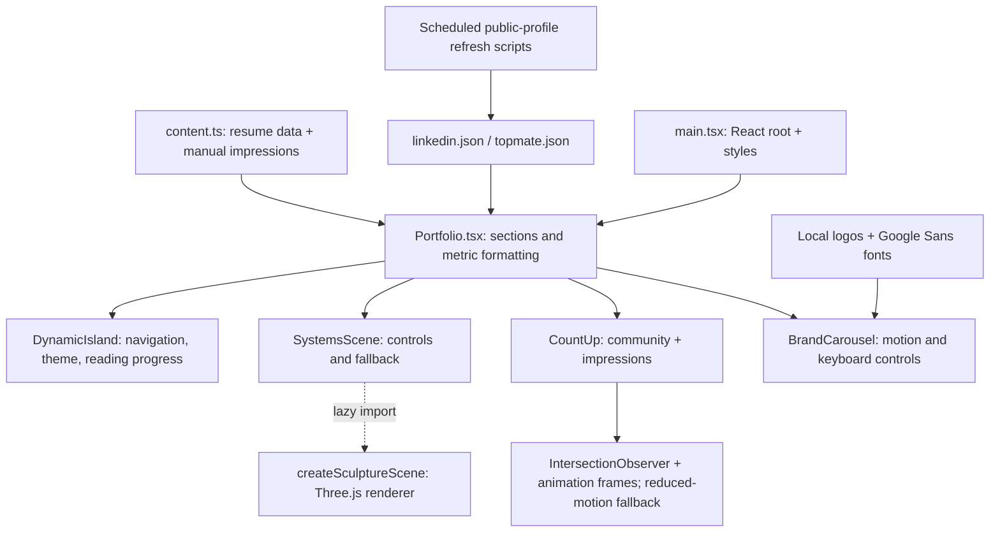

# 3D Resume Portfolio

Aditya Jamwal's portfolio as a software engineer, mentor, and technology content
creator. Built with React, TypeScript, Vite, and Three.js, with an interactive
3D sculpture, light/dark themes, and accessible responsive layouts.

**[Visit the website](https://adityajamwal02.github.io/3D-resume/)**

## Website Sections

- **Introduction:** Engineering and mentorship focus, interactive sculpture, and career highlights.
- **Experience:** Microsoft, Cisco, and Ambee.
- **Work:** HashImagin and Multi-Agentic System.
- **Expertise:** Skills, education, and achievements.
- **Mentorship:** Session guide, booking links, and testimonials.
- **Content:** LinkedIn community and impressions counters, social links, and brand collaborations.
- **Contact:** Professional links and a dynamic copyright footer.

## Architecture

Low-level component and data flow. The static site is built and deployed to
GitHub Pages; public-profile refreshes run outside the visitor's browser.

Development, content maintenance, testing, deployment, and implementation history
are documented in the [maintainer guide](docs/maintainer-guide.md).
